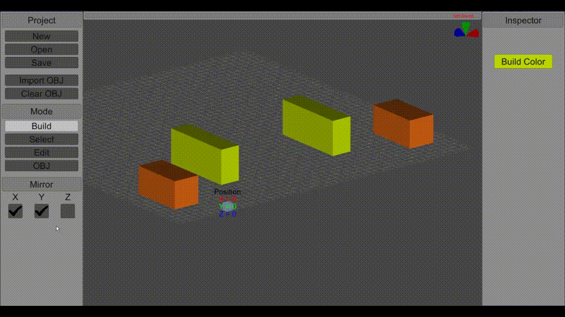

# DU-Build-Planner

DU-Build-Planner is a three-dimensional voxel editor with advanced features. It replicates the building mechanics from [Dual Universe](https://www.dualuniverse.game/).

Features
-------------

- Creating and moving voxels
- Setting any colors for each voxel
- Editing the shape of the voxels as you wish
- Using a mirror for symmetrical editing
- Upload three-dimensional models in the format .obj
- Automatic real-time saving

Launching
-------------
- Download the sources from this repository
- Open the project folder in Unity (version 2019.3 and later)
- Choose File -> Build Settings
- In the list of platforms, choose Windows, Mac, Linux and click Build
- Set the path to create binary files
- Open the "NDR 3D Voxel Designer.exe" file

